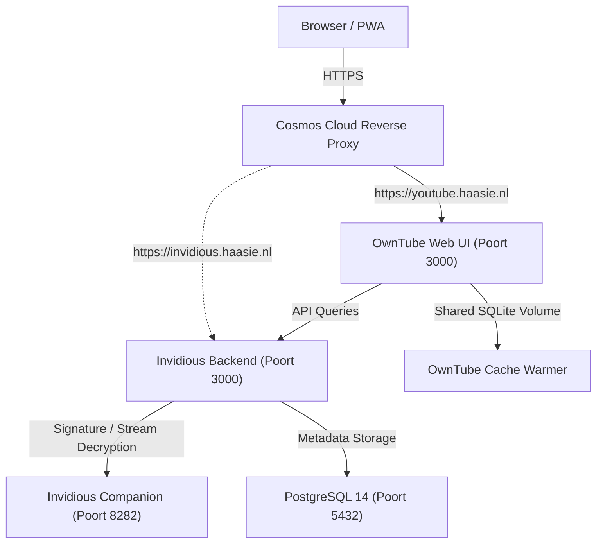

# 🎬 Invidious + OwnTube op Cosmos Cloud

Deze setup draait een complete, privacy-vriendelijke YouTube suite op Cosmos Cloud:
- **Invidious**: Volledige self-hosted YouTube backend API met Invidious Companion (tegen YouTube bot-checks) en PostgreSQL database.
- **OwnTube** (`https://github.com/mdbraber/owntube`): Moderne Next.js 15 UI met Vidstack player, eigen lokale aanbevelingsengine (TF-IDF + MMR), kijkgeschiedenis en abonnementenbeheer in SQLite, SponsorBlock/PiP ondersteuning en een automatische achtergrond cache-warmer.

---

## 🏗️ Architectuur



---

## 🚀 Services in `docker-compose.yml`

1. **`owntube`**: De hoofdinterface.
2. **`owntube-cache-warmer`**: Draait elke 20 minuten om trending video's, kanalen en shorts voor te verwarmen (standaard regio: `NL`).
3. **`invidious`**: De YouTube scraping & streaming API proxy.
4. **`invidious-companion`**: Companion service die token decryptie en YouTube signature parsing regelt met een unieke 16-karakter geheime sleutel.
5. **`invidious-db`**: PostgreSQL database met tabellen voor kanalen, video's en sessies.

---

## 🌐 Cosmos Cloud Routes Aanmaken

### 1. Hoofdroute: OwnTube (Aanbevolen)
- **Target Type**: `Container`
- **Target Container**: `owntube`
- **Target Port**: `3000`
- **Host / Subdomain**: `youtube.haasie.nl` (of `owntube.haasie.nl`)
- **TLS / HTTPS**: Let's Encrypt SSL aan
- **Smart Shield**: Actief
- **Cosmos Auth**: Optioneel (OwnTube heeft ook eigen ingebouwde accounts en authenticatie via Auth.js)

### 2. Optionele Route: Directe Invidious Backend
- **Target Type**: `Container`
- **Target Container**: `invidious`
- **Target Port**: `3000`
- **Host / Subdomain**: `invidious.haasie.nl`
- **TLS / HTTPS**: Let's Encrypt SSL aan

---

## ⚙️ Beheer & Handige Commando's

```bash
# Containers starten / herstarten
cd /home/haasie/owntube
docker compose up -d

# Status controleren
docker compose ps

# Logs bekijken van OwnTube of Invidious
docker compose logs -f owntube
docker compose logs -f invidious

# Cache handmatig eenmalig verwarmen
docker compose exec owntube pnpm warm:cache
```
