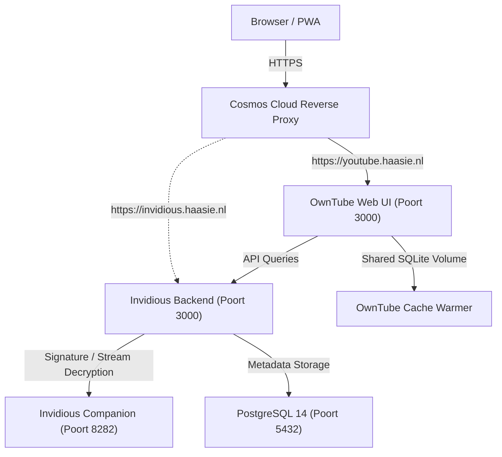

# 🎬 Invidious + OwnTube op Cosmos Cloud

Deze setup draait een complete, privacy-vriendelijke YouTube suite op Cosmos Cloud:
- **Invidious**: Volledige self-hosted YouTube backend API met Invidious Companion (tegen YouTube bot-checks) en PostgreSQL database.
- **OwnTube** (`https://github.com/mdbraber/owntube`): Moderne Next.js 15 UI met Vidstack player, eigen lokale aanbevelingsengine (TF-IDF + MMR), kijkgeschiedenis en abonnementenbeheer in SQLite, SponsorBlock/PiP ondersteuning en een automatische achtergrond cache-warmer.

---

## 🏗️ Architectuur


```mermaid
graph TD
    Client["Browser / PWA"] -->|HTTPS| Cosmos["Cosmos Cloud Reverse Proxy"]
    Cosmos -->|https://youtube.haasie.nl| OwnTube["OwnTube Web UI (Poort 3000)"]
    Cosmos -.->|https://invidious.haasie.nl| Invidious["Invidious Backend (Poort 3000)"]
    OwnTube -->|API Queries| Invidious
    OwnTube -->|Shared SQLite Volume| Warmer["OwnTube Cache Warmer"]
    Invidious -->|Signature / Stream Decryption| Companion["Invidious Companion (Poort 8282)"]
    Invidious -->|Metadata Storage| Postgres["PostgreSQL 14 (Poort 5432)"]
```

---

## 🚀 Services in `docker-compose.yml`

1. **`owntube`**: De hoofdinterface.
2. **`owntube-cache-warmer`**: Draait elke 20 minuten om trending video's, kanalen en shorts voor te verwarmen (standaard regio: `NL`).
3. **`invidious`**: De YouTube scraping & streaming API proxy.
4. **`invidious-companion`**: Companion service die token decryptie en YouTube signature parsing regelt met een unieke 16-karakter geheime sleutel.
5. **`invidious-db`**: PostgreSQL database met tabellen voor kanalen, video's en sessies.

---

## 🌐 Cosmos Cloud Routes Aanmaken

### 1. Hoofdroute: OwnTube (Aanbevolen)
- **Target Type**: `Container`
- **Target Container**: `owntube`
- **Target Port**: `3000`
- **Host / Subdomain**: `youtube.haasie.nl` (of `owntube.haasie.nl`)
- **TLS / HTTPS**: Let's Encrypt SSL aan
- **Smart Shield**: Uit (zie [Video blijft hangen](#-video-blijft-hangen-op-iphone--safari))
- **Cosmos Auth**: Optioneel (OwnTube heeft ook eigen ingebouwde accounts en authenticatie via Auth.js).
  Staat hij aan, maak dan ook de mediaroutes `/hls`, `/stream` en `/captions`
  zonder auth aan, anders speelt de iPhone niets af (zie [stap 5](#-video-blijft-hangen-op-iphone--safari)).

### 2. Optionele Route: Directe Invidious Backend
- **Target Type**: `Container`
- **Target Container**: `invidious`
- **Target Port**: `3000`
- **Host / Subdomain**: `invidious.haasie.nl`
- **TLS / HTTPS**: Let's Encrypt SSL aan

---

## 📱 Video blijft hangen op iPhone / Safari

Symptoom: de video laadt, toont één beeld (vaak op het hervat-punt) en blijft
dan staan met de pauzeknop zichtbaar; handmatig scrubben laat hem een paar
seconden lopen en dan hangt hij weer. Loop dit in deze volgorde af:

1. **Meten waar de bytes stoppen** (read-only, ~1 min). Probeer de video eerst
   één keer op de iPhone, dan:

   ```bash
   cd /home/haasie/owntube
   sh scripts/diagnose-playback.sh <videoId>
   ```

   - Sectie 1: welk protocol je browser van Cosmos krijgt.
   - Sectie 2: dezelfde byte-ranges via Invidious, de companion en OwnTube's
     eigen `/stream`, met een verdict. Alles sneller dan realtime → de server
     is in orde, het zit tussen Cosmos en de iPhone.
   - Sectie 3: de HLS-playlist opgehaald zoals de iPhone-speler (AVPlayer)
     dat doet, zonder login-cookie. Geen playlist → stap 5.
   - Sectie 4: welke requests van de iPhone-speler OwnTube echt bereikt
     hebben, plus fouten en rapporten van de player.

2. **HTTP/2 uit in Cosmos.** Cosmos is een Go-server en zet HTTP/2 automatisch
   aan. Safari's HTTP/2-verbinding loopt vast zodra een media-request wordt
   afgebroken (seek, hervatten, kwaliteitswissel): daarna komt er op die
   verbinding niets meer binnen, tot een nieuwe seek toevallig een nieuwe
   verbinding opent. Precies het patroon uit de recording: hangen op het
   hervat-punt, na scrubben een paar seconden spelen, weer hangen.

   ```bash
   sudo bash scripts/cosmos-http2-off.sh          # terugdraaien: --undo
   ```

   Het script zet `GODEBUG=http2server=0` op Cosmos, zodat alle routes over
   HTTP/1.1 gaan. Het herkent zelf of Cosmos native (systemd `CosmosCloud`) of
   als Docker-container draait. De Docker-container wordt opnieuw aangemaakt met
   dezelfde config plus de env-var (sites achter Cosmos zijn ±10–30 s weg); de
   oude blijft gestopt bewaard en wordt automatisch teruggezet als de nieuwe niet
   opkomt. Via de Cosmos-UI kan dit niet: Cosmos maakt zijn eigen container
   opnieuw aan met de oude config. Het script eindigt met het protocol dat
   `youtube.haasie.nl` nu praat (verwacht: `1.1`). Staat er in sectie 1 van de
   diagnose een `cf-ray`-header, dan komt de HTTP/2 van Cloudflare en niet van
   Cosmos.

3. **Smart Shield uit op de OwnTube-route.** Smart Shield rekent elke response
   ≥ 400 als 30 requests (standaard budget 36.000 per uur). Een afgebroken
   media-request vóór de headers wordt in Cosmos een 502, dus een haperende
   player verbruikt dat budget snel: daarna blokkeert Cosmos je IP een uur
   (429 op alles, ook de pagina), na drie keer vier uur.

4. **Streams via de companion** staat standaard aan: OwnTube haalt video-bytes
   bij de companion's `/companion/videoplayback` via
   `INVIDIOUS_COMPANION_INTERNAL_URL` (het pad dat Invidious' eigen player met
   een companion gebruikt), en valt per request terug op Invidious'
   `/videoplayback` als de companion weigert. Nooit via
   `invidious.haasie.nl`: daar staat Cosmos-auth voor. Uitzetten:
   `INVIDIOUS_STREAM_VIA_COMPANION=false` in `.env` en `docker compose up -d owntube`.

5. **Media zonder Cosmos-login** — alleen als sectie 3 van de diagnose geen
   playlist maar een login-redirect laat zien. De iPhone speelt HLS af via
   AVPlayer, en die stuurt de login-cookie van de pagina niet mee: Cosmos-auth
   geeft hem een loginpagina, iOS meldt `MEDIA_ERR_SRC_NOT_SUPPORTED` en OwnTube
   valt terug op 360p progressive. Maak in Cosmos voor `youtube.haasie.nl` per
   pad een extra route naar `owntube:3000`, met **path prefix** `/hls`,
   `/stream` en `/captions` (prefix niet strippen), **Cosmos-auth uit** en
   Smart Shield uit.

   Zet daarbij **`MEDIA_TOKEN_REQUIRED=true`** op `owntube` (in deze fork staat
   dat al in `docker-compose.yml`). Zonder die vlag checken die paden zelf
   geen login, en kan iedereen die het domein kent je server als
   YouTube-proxy gebruiken. Met de vlag serveren ze alleen URLs die OwnTube
   zelf in een pagina heeft gezet: elke media-URL draagt een ondertekend token
   (`mt=<verloopt>.<handtekening>`, afgeleid van `AUTH_SECRET`, 12 uur
   geldig), en zonder geldig token antwoorden ze `403`. Thumbnails en avatars
   blijven open. Een tabblad dat langer openstaat haalt vanzelf een nieuw
   token op.

   Zet alleen die drie prefixes buiten Cosmos-auth. `/api`, `/dash`,
   `/yt-hls` en `/enclosure` delen tokens uit en moeten erachter blijven.

   Draai daarna de diagnose opnieuw. Sectie 3 moet zonder token `403` geven
   (OwnTube weigert zelf) en met token `200` en
   `application/vnd.apple.mpegurl`. Een redirect in plaats van `403`? Dan
   pakt Cosmos de hoofdroute eerst. Cosmos registreert routes van onder naar
   boven (`buildFromConfig.go`), dus de **onderste** route in de lijst wint:
   zet de drie nieuwe routes via **⋯ → Move to bottom** onder de hoofdroute,
   sla op en test opnieuw. Nieuwe routes komen bovenaan de lijst, dus dit is
   altijd nodig.

---

## 🔄 Automatische updates

Elke push naar `main` draait `.github/workflows/deploy.yml`:

1. `pnpm lint` en `pnpm test`. Faalt er iets, dan stopt het hier en blijft
   de server op de vorige versie.
2. Bouwt `apps/web/Dockerfile` en pusht `ghcr.io/haasie/owntube:latest`
   (plus een `sha-<commit>`-tag).
3. Roept de Cosmos-webhook aan, zodat Cosmos de nieuwe image meteen ophaalt.

`owntube` en `owntube-cache-warmer` dragen het label `cosmos-auto-update=true`
en `pull_policy: always`. Zonder webhook pakt Cosmos de nieuwe image dus nog
steeds op, maar pas bij zijn eigen periodieke check (dat kan uren duren).

**Eenmalig, voor direct uitrollen:** open in Cosmos de ServApp `owntube` →
**Settings**, kopieer de **Webhook URL** en zet hem als repo-secret:

```bash
gh secret set COSMOS_WEBHOOK_URL --repo Haasie/owntube
```

(`gh` vraagt dan om de waarde; plak de URL.) Zonder secret geeft de workflow
een waarschuwing in plaats van stil over te slaan.

**Controleren wat er live draait:**

```bash
docker inspect owntube --format '{{index .Config.Labels "org.opencontainers.image.revision"}}'
```

Dat moet gelijk zijn aan de laatste commit op `main`. Handmatig forceren:
`./update.sh -f` (haalt de image op en maakt de containers opnieuw aan; er
wordt op de server niets meer gebouwd).

---

## ⚙️ Beheer & Handige Commando's

```bash
# Containers starten / herstarten
cd /home/haasie/owntube
docker compose up -d

# Status controleren
docker compose ps

# Logs bekijken van OwnTube of Invidious
docker compose logs -f owntube
docker compose logs -f invidious

# Cache handmatig eenmalig verwarmen
docker compose exec owntube pnpm warm:cache
```
