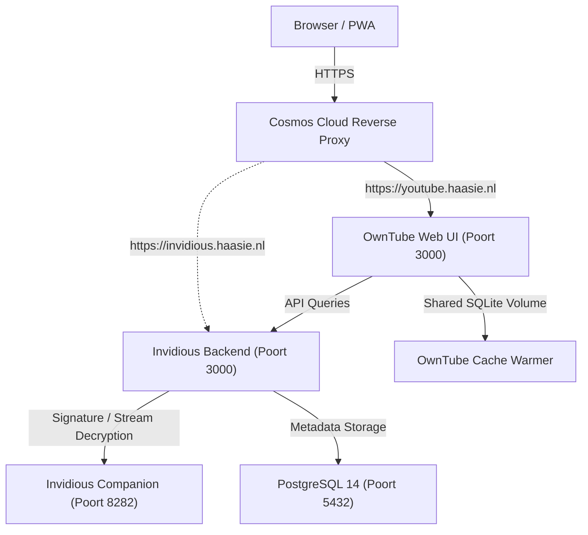

# 🎬 Invidious + OwnTube op Cosmos Cloud

Deze setup draait een complete, privacy-vriendelijke YouTube suite op Cosmos Cloud:
- **Invidious**: Volledige self-hosted YouTube backend API met Invidious Companion (tegen YouTube bot-checks) en PostgreSQL database.
- **OwnTube** (`https://github.com/mdbraber/owntube`): Moderne Next.js 15 UI met Vidstack player, eigen lokale aanbevelingsengine (TF-IDF + MMR), kijkgeschiedenis en abonnementenbeheer in SQLite, SponsorBlock/PiP ondersteuning en een automatische achtergrond cache-warmer.

---

## 🏗️ Architectuur


```mermaid
graph TD
    Client["Browser / PWA"] -->|HTTPS| Cosmos["Cosmos Cloud Reverse Proxy"]
    Cosmos -->|https://youtube.haasie.nl| OwnTube["OwnTube Web UI (Poort 3000)"]
    Cosmos -.->|https://invidious.haasie.nl| Invidious["Invidious Backend (Poort 3000)"]
    OwnTube -->|API Queries| Invidious
    OwnTube -->|Shared SQLite Volume| Warmer["OwnTube Cache Warmer"]
    Invidious -->|Signature / Stream Decryption| Companion["Invidious Companion (Poort 8282)"]
    Invidious -->|Metadata Storage| Postgres["PostgreSQL 14 (Poort 5432)"]
```

---

## 🚀 Services in `docker-compose.yml`

1. **`owntube`**: De hoofdinterface.
2. **`owntube-cache-warmer`**: Draait elke 20 minuten om trending video's, kanalen en shorts voor te verwarmen (standaard regio: `NL`).
3. **`invidious`**: De YouTube scraping & streaming API proxy.
4. **`invidious-companion`**: Companion service die token decryptie en YouTube signature parsing regelt met een unieke 16-karakter geheime sleutel.
5. **`invidious-db`**: PostgreSQL database met tabellen voor kanalen, video's en sessies.

---

## 🌐 Cosmos Cloud Routes Aanmaken

### 1. Hoofdroute: OwnTube (Aanbevolen)
- **Target Type**: `Container`
- **Target Container**: `owntube`
- **Target Port**: `3000`
- **Host / Subdomain**: `youtube.haasie.nl` (of `owntube.haasie.nl`)
- **TLS / HTTPS**: Let's Encrypt SSL aan
- **Smart Shield**: Uit (zie [Video blijft hangen](#-video-blijft-hangen-op-iphone--safari))
- **Cosmos Auth**: Optioneel (OwnTube heeft ook eigen ingebouwde accounts en authenticatie via Auth.js)

### 2. Optionele Route: Directe Invidious Backend
- **Target Type**: `Container`
- **Target Container**: `invidious`
- **Target Port**: `3000`
- **Host / Subdomain**: `invidious.haasie.nl`
- **TLS / HTTPS**: Let's Encrypt SSL aan

---

## 📱 Video blijft hangen op iPhone / Safari

Symptoom: de video laadt, toont één beeld (vaak op het hervat-punt) en blijft
dan staan met de pauzeknop zichtbaar; handmatig scrubben laat hem een paar
seconden lopen en dan hangt hij weer. Loop dit in deze volgorde af:

1. **Meten waar de bytes stoppen** (read-only, ~1 min):

   ```bash
   cd /home/haasie/owntube
   sh scripts/diagnose-playback.sh <videoId>
   ```

   Sectie 1 toont welk protocol je browser krijgt, sectie 2 dezelfde
   byte-ranges via Invidious, de companion en OwnTube's eigen `/stream`, en
   eindigt met een verdict. Alles groen in sectie 2 maar nog steeds hangen →
   het zit tussen Cosmos en Safari (stap 2).

2. **HTTP/2 uit in Cosmos.** Cosmos is een Go-server en zet HTTP/2 automatisch
   aan. Safari's HTTP/2-verbinding loopt vast zodra een media-request wordt
   afgebroken (seek, hervatten, kwaliteitswissel): daarna komt er op die
   verbinding niets meer binnen, tot een nieuwe seek toevallig een nieuwe
   verbinding opent. Precies het patroon uit de recording: hangen op het
   hervat-punt, na scrubben een paar seconden spelen, weer hangen. Zet op de
   **cosmos-server** container de env-var:

   ```
   GODEBUG=http2server=0
   ```

   Via de Cosmos-UI (ServApps → cosmos-server → Docker → Environment
   Variables) of door de container opnieuw aan te maken met
   `-e GODEBUG=http2server=0`; de self-updater neemt env-vars mee bij updates.
   Alle routes gaan dan over HTTP/1.1. Controleren:

   ```bash
   curl -so /dev/null -w '%{http_version}\n' https://youtube.haasie.nl/   # verwacht: 1.1
   ```

   Staat er in sectie 1 van de diagnose een `cf-ray`-header, dan komt de
   HTTP/2 van Cloudflare en niet van Cosmos.

3. **Smart Shield uit op de OwnTube-route.** Smart Shield rekent elke response
   ≥ 400 als 30 requests (standaard budget 36.000 per uur). Een afgebroken
   media-request vóór de headers wordt in Cosmos een 502, dus een haperende
   player verbruikt dat budget snel: daarna blokkeert Cosmos je IP een uur
   (429 op alles, ook de pagina), na drie keer vier uur.

4. **Streams via de companion** staat standaard aan: OwnTube haalt video-bytes
   bij de companion's `/companion/videoplayback` via
   `INVIDIOUS_COMPANION_INTERNAL_URL` (het pad dat Invidious' eigen player met
   een companion gebruikt), en valt per request terug op Invidious'
   `/videoplayback` als de companion weigert. Nooit via
   `invidious.haasie.nl`: daar staat Cosmos-auth voor. Uitzetten:
   `INVIDIOUS_STREAM_VIA_COMPANION=false` in `.env` en `docker compose up -d owntube`.

---

## ⚙️ Beheer & Handige Commando's

```bash
# Containers starten / herstarten
cd /home/haasie/owntube
docker compose up -d

# Status controleren
docker compose ps

# Logs bekijken van OwnTube of Invidious
docker compose logs -f owntube
docker compose logs -f invidious

# Cache handmatig eenmalig verwarmen
docker compose exec owntube pnpm warm:cache
```
